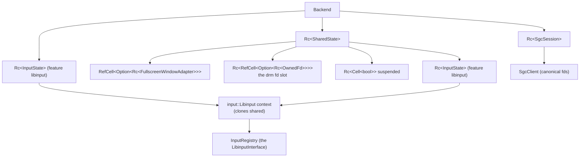
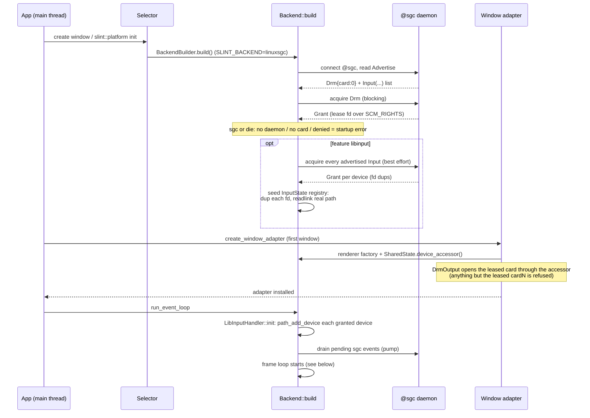
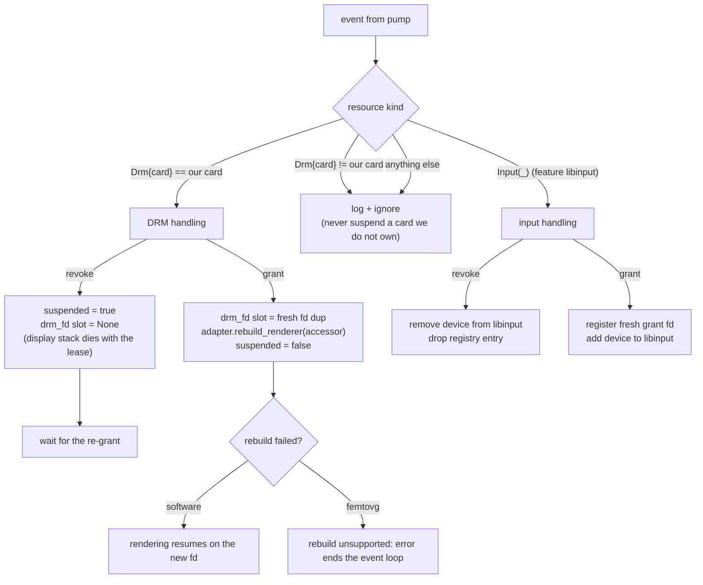

# Architecture

How the backend is structured, how it starts, and how the event loop runs.

## Modules

| File | Role |
| --- | --- |
| lib.rs | Crate root: `BackendBuilder`, the `DeviceOpener` type alias, re-exports. Entry points for the selector. |
| calloop_backend/mod.rs | `Backend` (the `Platform`), `SharedState`, the sgc pump, the event loop. |
| calloop_backend/input.rs | `LibInputHandler`: a calloop event source that dispatches libinput events to the window (pointer/touch/xkb keyboard). |
| calloop_backend/input_shared.rs | The input device registry (`InputRegistry`), its `LibinputInterface` implementation, and `InputState` (libinput context owner). |
| sgc.rs | `SgcSession`: the backend's own client session against @sgc (connect, acquire, pump, fd dups). |
| fullscreenwindowadapter.rs | `FullscreenWindowAdapter` (`WindowAdapter`) and the `FullscreenRenderer` trait; the mouse cursor image. |
| renderer/sw.rs | Software renderer adapter (dumb-buffer display stack + CPU rendering). |
| renderer/femtovg.rs | GL renderer adapter (gbm/EGL, femtovg). |
| drmoutput.rs | `DrmOutput`: connector/crtc/mode selection on the lease, buffer management, page flips. |
| display/ | Display stacks: `swdisplay` (dumb buffers), `gbmdisplay` (gbm buffers for GL), the `Presenter` abstraction. |

Single-threaded: everything runs on the event-loop thread (the input device
registry, libinput, DRM page-flip waits, the sgc pump). There are no locks
between these — `RefCell`/`Rc` only.

## Ownership

Notes:

- `Backend` owns `SharedState` and the session; the **pump closure** (a calloop
  source with `'static` captures) only gets `Rc<SharedState>` + `Rc<SgcSession>`
  clones, never the `Backend` itself.
- The same `Rc<InputState>` is held by both `Backend` (to seed/start input at
  loop start) and `SharedState` (to route live grants/revokes). The libinput
  context inside is refcounted (`input::Libinput` is `Clone` — libinput_ref /
  libinput_unref), so `input.rs`'s handler and the pump routing each work on
  their own handle of the same context.
- `SharedState.window` is empty until the app creates a window; the pump uses
  it to drive suspend/rebuild, so a window must exist before the loop runs.

## Startup

The lease fd is stored in `SharedState.drm_fd` at build; the display stack is
NOT built at build time — it is built lazily when the first window adapter is
created, from a dup of that fd.

## The event loop

Sources registered with calloop:

| Source | Purpose |
| --- | --- |
| LibInputHandler (feature libinput) | READ on the libinput fd → dispatch input events |
| user event channel | `invoke_from_event_loop` callbacks (deferred to the animation tick) |
| 50 ms timer | the sgc pump: poll the session socket, handle revoke/re-grant |

The main loop (`run_event_loop`) iterates:

1. `update_timers_and_animations()` — advance slint's timer/animation clock.
2. run callbacks queued via `invoke_from_event_loop` (after the tick so they
   see a current start time).
3. `render_if_needed(mouse_position_property)` — redraw only if requested.
4. `event_loop.dispatch(next_timeout)` — block on all sources until the next
   timer/animation deadline.

Continuous animation (slint `Timer`s, `animate`d properties) keeps
`has_active_animations()` true; after every frame the adapter schedules a
single-shot zero-duration timer that calls `request_redraw()`, so an animated
scene redraws at the display's page-flip cadence. A scene with no animation
redraws only on demand (input, property writes, `request_redraw`).

## The sgc pump and event routing

`SgcSession::pump()` does a non-blocking poll on the session socket; the 50 ms
timer calls it in a loop until no event is pending, feeding each event to
`SharedState::on_sgc_event`. A lost connection (daemon died) surfaces as a
pump error: it is stashed as the fatal error, the loop is stopped, and
`run_event_loop` returns that error (a session cannot survive without the
daemon).

Rules that hold everywhere:

- Only the DRM resource touches the display state; input events only
  add/remove libinput devices, and vice versa.
- Only the card we actually hold may suspend/rebuild the display — the card
  index is checked against `SharedState.card`.
- Input acquisition/registration failures are logged and never fatal; the DRM
  lease is the only hard requirement (a keyboard-less UI is fine).

## Suspended rendering

While `suspended` is set (lease revoked), `render_if_needed` does nothing but
keeps `redraw_requested` true, so the first frame after the re-grant rebuilds
paints immediately. Animations continue to tick in the background (the scene
advances even though nothing is presented).
