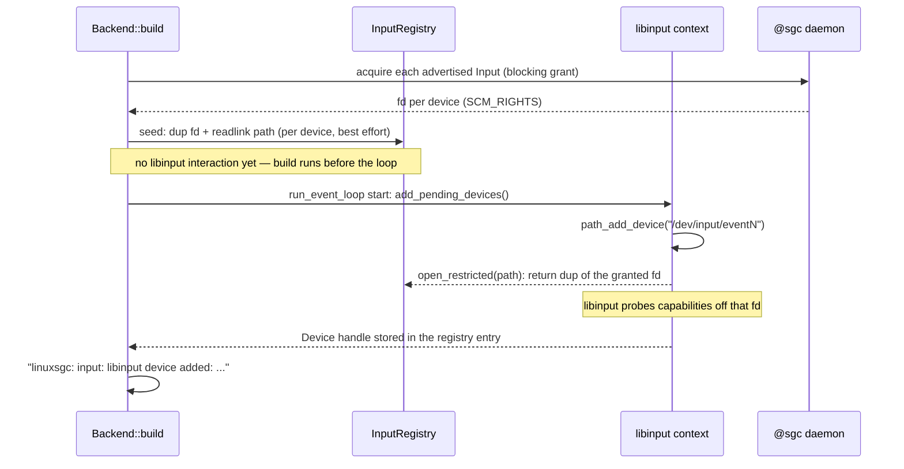
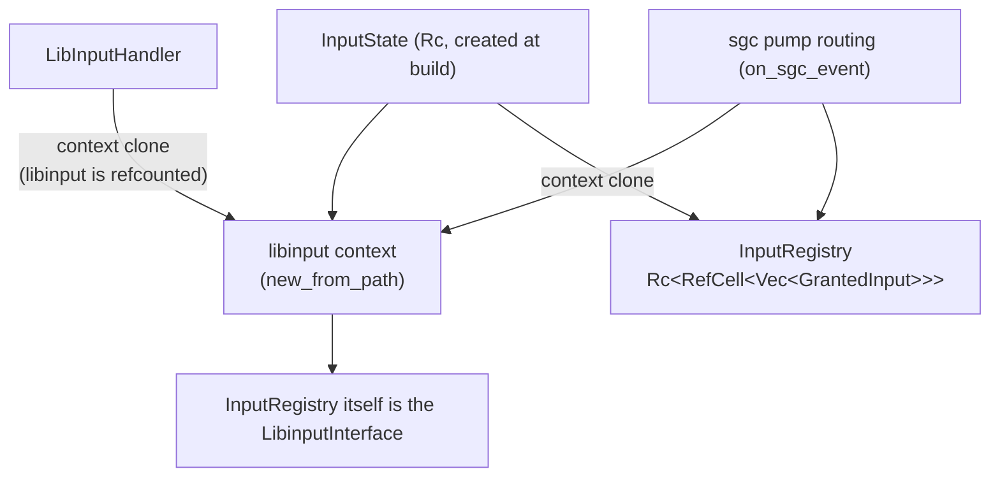
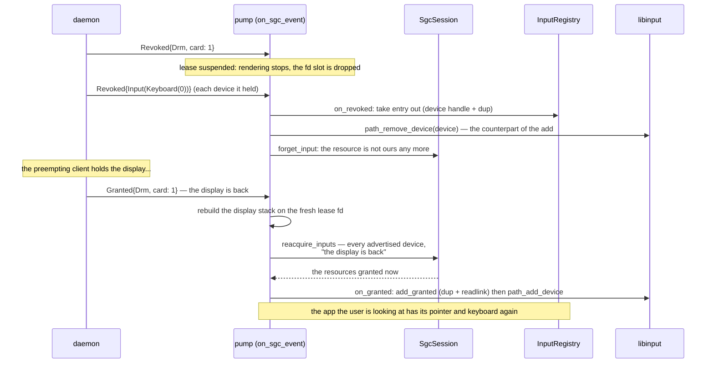

# Input

Pointer, keyboard and touch events come from **devices the @sgc daemon
granted** — the backend never opens `/dev/input` itself (sgc-or-die applies
to input as much as to display). The granted fds are fed into libinput's
*path* backend, whose normalized events are dispatched to the slint window.

Compiled in only with the `libinput` feature. Without it the backend renders
but receives no input (and libinput/libxkbcommon are not linked).

## Where the devices come from

The daemon (separate process, root) enumerates `/dev/input/event*`, classifies
each device (touch > mouse > keyboard, by capabilities), opens it, and
advertises it as a `Resource::Input(...)`:

- `Input(Keyboard(n))` — a device with real typing keys,
- `Input(Mouse(n))` — relative axes + buttons,
- `Input(Touch(n))` — absolute/multi-touch axes.

It keeps that list reconciled with `/dev/input` while it runs (an inotify watch,
see @sgc's `docs/resource-manager.md`): a device that appears — or a node
re-created by a udev trigger — is opened and advertised, one that goes away is
suspended for whoever holds it, and every change is pushed to the connections
that are already up, so a client that connected earlier IS told about a device
that appears later (see "A device that appears while the app runs"). The backend
acquires every advertised input alongside the DRM lease (best-effort — see
architecture.md).

## The key trick: libinput over granted fds

libinput does not accept pre-opened fds, but every device it opens goes
through the user-provided `LibinputInterface`. The backend uses the PATH
backend (`Libinput::new_from_path`) and its `open_restricted` **ignores the
path it is given** and returns a dup of the matching granted fd. The path
string is only libinput bookkeeping — the real `/dev/input/eventN` is
resolved once, at grant time, via `readlink(/proc/self/fd/<granted fd>)` (the
SCM_RIGHTS dup shares the daemon's open file description, so the readlink
yields the genuine path).

## Registration (startup)

`path_add_device` happens on the event-loop thread at loop start, never at
build time: libinput is not thread-safe and the add opens the device
synchronously through the interface.

## State layout

One `GrantedInput` per device:

| field | meaning |
| --- | --- |
| resource | the `Resource::Input(...)` it was granted as |
| fd | the registry's dup of the granted fd (the SgcClient keeps the canonical until the daemon revokes); O_NONBLOCK applied |
| path | the resolved `/dev/input/eventN` |
| device | libinput's `Device` handle once `path_add_device` succeeded (needed to remove it again) |

Two consumers share the state: the pump routing (live grant/revoke) and the
dispatch handler. Both run on the event-loop thread, so `Rc<RefCell<…>>`
suffices — with one discipline: **no registry borrow may be live across a
libinput call**, because `path_add_device`/`path_remove_device` re-enter the
registry synchronously through the interface. Callers snapshot what they
need, drop the borrow, then call libinput.

## The LibinputInterface contract

`open_restricted(path, flags)`:

1. looks the path up in the registry — anything else is a bug and is refused
   with ENOENT, **never** opened directly (sgc-or-die),
2. returns a fresh dup of the granted fd with the requested flags applied:
   - O_NONBLOCK via F_SETFL — a file-description flag: it lands on the open
     file description shared with the daemon's fd. Harmless (the daemon
     reads nothing from the device after granting), but never assume
     per-fd flag isolation,
   - O_CLOEXEC via F_SETFD — per-fd, set on the dup only,
   - the access mode cannot be changed with fcntl and already matches (the
     daemon opened the device read-only).

`close_restricted(fd)` just drops the dup; the registry keeps its own and the
SgcClient the canonical.

## Dispatch (events → window)

`LibInputHandler` is a calloop event source registered with READ interest on
the libinput fd (a clone of the context). When readable it calls
`libinput.dispatch()` then iterates events:

| event | slint delivery |
| --- | --- |
| pointer motion (relative) | `PointerMoved`, clamped to the screen; updates the cursor property |
| pointer motion (absolute) | `PointerMoved` at the transformed position |
| pointer button | `PointerPressed/Released` (BTN mapping left/right/middle/back/forward) |
| touch down/up/motion/cancel | `process_touch_input` per slot (up to 5 slots tracked; touch-up carries no position, so the last position per slot is replayed) |
| keyboard key | xkb: lazy `Keymap::new_from_names` (empty names = xkbcommon defaults, needs XKB data files on the target), key state kept in an `xkb::State`; `KeyPressed/Released` with the mapped text |
| device removed | the device was taken by the kernel (unplug, or a udev trigger re-created its node): drop the registry entry; see below |
| everything else | ignored (device ADDED and the rest — we only ever hand libinput what we granted, so its own add is redundant and the lifecycle stays explicit) |

Mouse motion/position lives in a shared `mouse_position` property that
`render_if_needed` consumes to draw the cursor (see rendering.md).

Keyboard chords handled in the backend: Ctrl+Alt+Backspace (or Delete) quits
the event loop — a useful end-to-end test signal on the board.

An optional `libinput_event_hook` (backend builder, feature `libinput`) can
filter/consume raw events before dispatch.

## A device that appears while the app runs

The daemon pushes its resource list again whenever it changes (a device plugged
in, a device removed), and that push is the only way a connection that is already
up can learn about a device that appeared after it connected — its view at
`connect` was a snapshot. `libsgc-rs` surfaces the push as
[`SgcEvent::Advertised`], and the backend adopts it:

- `SgcSession::adopt_advertised` acquires the `Input(_)` entries it has NOT been
  offered before and returns them; the pump registers each one with libinput
  (`InputState::on_granted`) on the event-loop thread — the same path a startup
  device takes, just later.
- "Not offered before" is what keeps a refusal from being repeated: the daemon
  keeps no memory of a request and the policy that refused one resource refuses
  it again, so re-asking on every push would only refill the log. A device that
  leaves the list and comes back IS asked for again (its holder may be gone by
  then).
- A resource that leaves the list needs nothing here: it was suspended (its
  device went away — this client keeps it, and the daemon re-grants it when the
  device returns) or revoked (`Revoked`), and in both cases libinput reports
  `DEVICE_REMOVED` on the holder's own fd — see "A device the kernel takes away".
- A resource that comes BACK on the list is not acquired either: if this client
  still holds it, the daemon re-grants it on its own, and `adopt_advertised`
  skips what is already in `session.inputs`.
- The lease is unaffected: this backend holds `Drm { card: N }` for its lifetime,
  so a change concerning a DRM card is not something it acts on.

A build without the `libinput` feature ignores the event (there is nothing it
could consume), which is the same rule as at connect: a client that cannot
consume a resource must not hold it.

## A denied input is permanent

Inputs are acquired once, at `connect_and_acquire`, and a refusal is not retried
— the daemon keeps no memory of the request and the protocol has no "tell me when
it is free". So a denial is a fact for the app's whole lifetime, and the log says
so, naming the device kind the app will be missing and what to do about it:

    linuxsgc: cannot take Input(Keyboard(0)) — the daemon denied it (held by another client).
    This app will receive no keyboard events for its whole lifetime: another client holds the
    device and the daemon's policy is first-owner, which denies a newcomer rather than preempting
    the holder. Restart this app once that client releases the device, or run @sgc with its
    default fair-queue policy, where a newcomer preempts the holder instead

Input is owned by CLASS, not by the seat alone. A client holding a display is the
SEAT, and the seat TAKES a device somebody else holds with the policy bypassed —
under `first-owner` too — so an app like this one (sgc-or-die: it always holds
`Drm`) is denied only when the device is suspended (its device is away and its
holder keeps it) or when two seats collide, which is unreachable today. A client
WITHOUT a display ranks last: it may hold a device nobody else holds, it is denied
one somebody holds, and it never queues. Retrying the acquire is deliberately NOT
done: an automatic retry would be a retry-steal for the seat, and today's policies
only deny when they never preempt. One exception, and it is not a retry: losing
and regaining the display re-asks for every advertised device ("The seat changes
hands"), so a refusal lasts only as long as the app keeps the seat.

A QUEUED acquire is not a denial, and is not reported as one. When the daemon
queues the request — it pushes the holder's `Revoke` and answers `Queued` —
`libsgc-rs` returns `SgcError::Queued`, and the backend says so instead of
promising the app will never see the device:

    linuxsgc: cannot take Input(Keyboard(2)) yet — the daemon queued the request (it is
    revoking whoever holds the device): the keyboard arrives through the event loop a moment
    later. This is not a denial

## The seat changes hands

Input is owned by class: the client holding the display holds the devices, and a
client with no display may only hold one nobody else is asking for. So the
interesting revoke is not one device being taken — it is the DISPLAY being taken,
which revokes every device that went with it:

An input revoke can also arrive alone — the seat takes a device from a
display-less holder — and is handled the same way: the registry entry goes, the
session forgets the resource, and the device is added back if a grant follows.

Two rules make the handover work:

- **The re-acquire is triggered by the DISPLAY grant**, not by the input revokes:
  asking while holding no display is exactly what the daemon denies, and the
  display is what makes this client the seat again.
- **`reacquire_inputs` ignores the "have I been offered this before" guard** that
  `adopt_advertised` uses. That guard exists to stop a REFUSAL being repeated on
  every push; after losing and regaining the screen the devices are very likely
  free, and not asking leaves an app that is visible but has no pointer and no
  keyboard.

A device that merely went away is a different case entirely — no revoke at all,
the session keeps holding it, and the daemon re-grants it when the device comes
back ("A device the kernel takes away").

## Held keys and touches need no reset

Nothing in the backend resets the xkb state or the touch slots when a device
goes away, because libinput already does the part that matters: removing a device
releases the keys it held, so the xkb state cannot keep a modifier down, and it
cancels its touches, so no slot is left replaying a position for a device that is
gone. Verified on the board against the pre-change binary: with Ctrl and Alt held
down through a steal/re-grant cycle, a later plain Backspace stayed a plain
Backspace — while the same process still quit on the full Ctrl+Alt+Backspace
chord, so the chord path itself was healthy, not merely dead input.

An explicit reset would be worse than nothing: xkb keeps ONE state for all
keyboards, so clearing it because one keyboard went away would drop a modifier
legitimately held on another one.

## A device the kernel takes away

An unplug — or a udev trigger, which installing anything with udev rules runs —
removes or re-creates `/dev/input/eventN` under the running daemon. Two things
notice, independently:

- the **daemon** reconciles its devices with `/dev/input` (inotify, plus a 60 s
  safety pass). A node that is gone AND whose device is gone SUSPENDS the
  resource: it leaves the advertised list, keeps its holder, and is handed back
  to that same client when the device returns (fresh fd, same name, no
  re-acquire). Nothing is revoked for a device leaving the machine — an app that
  is on screen with a mouse must not lose the mouse because the mouse was
  unplugged. A udev trigger that re-creates the node for a device that never
  moved is not even that: the daemon replaces its OWN fd and the holder's dup
  keeps working;
- **libinput**, reading the holder's dup, gets `ENODEV` and reports
  `DEVICE_REMOVED`; the backend then drops the libinput entry — libinput has
  already removed the device, so there is no `path_remove_device` to make — while
  KEEPING the resource's claim, because the daemon is about to hand it back:

      linuxsgc: input: Input(Keyboard(0)) (event6) was removed by the kernel — dropped from libinput;
      the grant is kept and the device comes back to this client

The device then comes back as an unsolicited `Granted` (a `Grant` with no
acquire: the daemon resumed the resource for its holder), and the pump hands it
to `InputState::on_granted`, the same path a startup device or a preemption
re-grant takes. From the app's point of view the pointer stops and then works
again: no restart, no re-acquire, and no window in which another client could
take the name.

### The race this has, and how it is closed

A device that goes away and comes back lands on the SAME node path, so the
removal event for the device it replaced carries the same sysname as the fresh
entry — and it can arrive AFTER the re-grant has been registered. Dropping the
entry by sysname alone would take away the device the app just got back, with
nothing left to bring it back a second time. `InputRegistry::take_removed_by_sysname`
therefore also checks the entry's own fd: if it still resolves to a live node
(`readlink /proc/self/fd/N` carries no ` (deleted)` marker), the removal belongs
to a device this entry replaced, and the entry is kept:

    linuxsgc: input: a removal arrived for event6, but Input(Keyboard(2)) is a device that came back — keeping it

A grant whose fd still resolves to a deleted node (the daemon has not re-opened
the re-created node yet) is skipped at registration — see `add_granted`.
