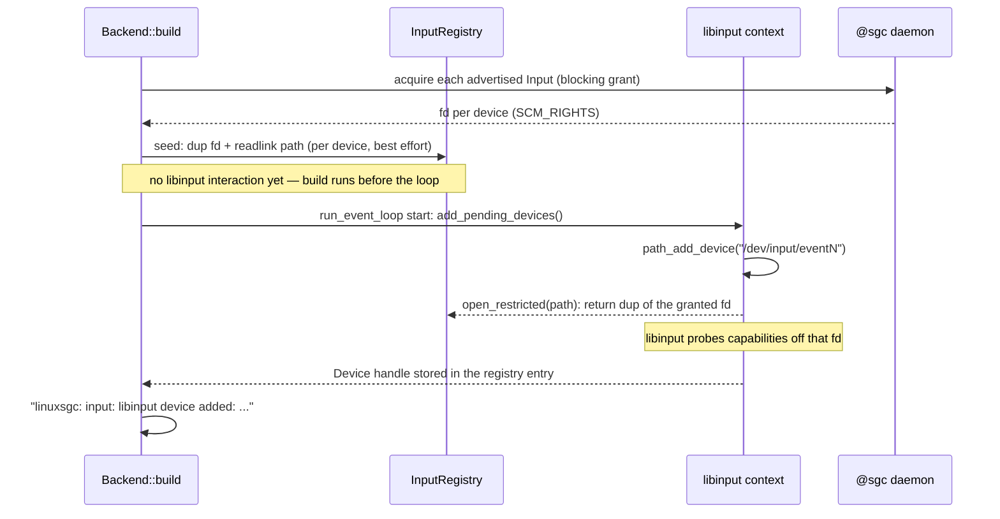
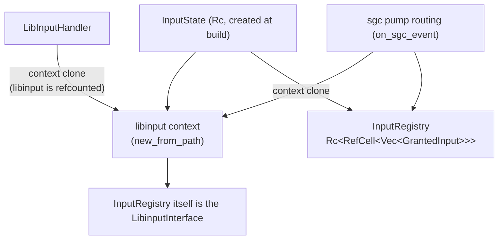
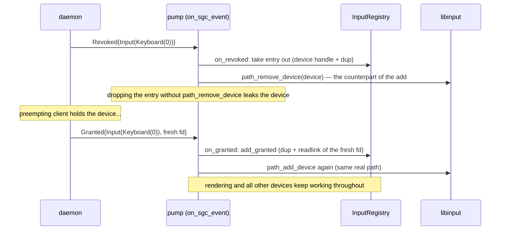

# Input

Pointer, keyboard and touch events come from **devices the @sgc daemon
granted** — the backend never opens `/dev/input` itself (sgc-or-die applies
to input as much as to display). The granted fds are fed into libinput's
*path* backend, whose normalized events are dispatched to the slint window.

Compiled in only with the `libinput` feature. Without it the backend renders
but receives no input (and libinput/libxkbcommon are not linked).

## Where the devices come from

The daemon (separate process, root) enumerates `/dev/input/event*`, classifies
each device (touch > mouse > keyboard, by capabilities), opens it, and
advertises it as a `Resource::Input(...)`:

- `Input(Keyboard(n))` — a device with real typing keys,
- `Input(Mouse(n))` — relative axes + buttons,
- `Input(Touch(n))` — absolute/multi-touch axes.

It keeps that list reconciled with `/dev/input` while it runs (every couple of
seconds, see @sgc's `docs/resource-manager.md`): a device that appears — or a
node re-created by a udev trigger — is opened and advertised, and one that goes
away is withdrawn. What stays per-connection is the advertise message itself, so
an already-connected client is not told about a device that appears later; the
backend acquires every advertised input alongside the DRM lease (best-effort —
see architecture.md).

## The key trick: libinput over granted fds

libinput does not accept pre-opened fds, but every device it opens goes
through the user-provided `LibinputInterface`. The backend uses the PATH
backend (`Libinput::new_from_path`) and its `open_restricted` **ignores the
path it is given** and returns a dup of the matching granted fd. The path
string is only libinput bookkeeping — the real `/dev/input/eventN` is
resolved once, at grant time, via `readlink(/proc/self/fd/<granted fd>)` (the
SCM_RIGHTS dup shares the daemon's open file description, so the readlink
yields the genuine path).

## Registration (startup)

`path_add_device` happens on the event-loop thread at loop start, never at
build time: libinput is not thread-safe and the add opens the device
synchronously through the interface.

## State layout

One `GrantedInput` per device:

| field | meaning |
| --- | --- |
| resource | the `Resource::Input(...)` it was granted as |
| fd | the registry's dup of the granted fd (the SgcClient keeps the canonical until the daemon revokes); O_NONBLOCK applied |
| path | the resolved `/dev/input/eventN` |
| device | libinput's `Device` handle once `path_add_device` succeeded (needed to remove it again) |

Two consumers share the state: the pump routing (live grant/revoke) and the
dispatch handler. Both run on the event-loop thread, so `Rc<RefCell<…>>`
suffices — with one discipline: **no registry borrow may be live across a
libinput call**, because `path_add_device`/`path_remove_device` re-enter the
registry synchronously through the interface. Callers snapshot what they
need, drop the borrow, then call libinput.

## The LibinputInterface contract

`open_restricted(path, flags)`:

1. looks the path up in the registry — anything else is a bug and is refused
   with ENOENT, **never** opened directly (sgc-or-die),
2. returns a fresh dup of the granted fd with the requested flags applied:
   - O_NONBLOCK via F_SETFL — a file-description flag: it lands on the open
     file description shared with the daemon's fd. Harmless (the daemon
     reads nothing from the device after granting), but never assume
     per-fd flag isolation,
   - O_CLOEXEC via F_SETFD — per-fd, set on the dup only,
   - the access mode cannot be changed with fcntl and already matches (the
     daemon opened the device read-only).

`close_restricted(fd)` just drops the dup; the registry keeps its own and the
SgcClient the canonical.

## Dispatch (events → window)

`LibInputHandler` is a calloop event source registered with READ interest on
the libinput fd (a clone of the context). When readable it calls
`libinput.dispatch()` then iterates events:

| event | slint delivery |
| --- | --- |
| pointer motion (relative) | `PointerMoved`, clamped to the screen; updates the cursor property |
| pointer motion (absolute) | `PointerMoved` at the transformed position |
| pointer button | `PointerPressed/Released` (BTN mapping left/right/middle/back/forward) |
| touch down/up/motion/cancel | `process_touch_input` per slot (up to 5 slots tracked; touch-up carries no position, so the last position per slot is replayed) |
| keyboard key | xkb: lazy `Keymap::new_from_names` (empty names = xkbcommon defaults, needs XKB data files on the target), key state kept in an `xkb::State`; `KeyPressed/Released` with the mapped text |
| device removed | the device was taken by the kernel (unplug, or a udev trigger re-created its node): drop the registry entry; see below |
| everything else | ignored (device ADDED and the rest — we only ever hand libinput what we granted, so its own add is redundant and the lifecycle stays explicit) |

Mouse motion/position lives in a shared `mouse_position` property that
`render_if_needed` consumes to draw the cursor (see rendering.md).

Keyboard chords handled in the backend: Ctrl+Alt+Backspace (or Delete) quits
the event loop — a useful end-to-end test signal on the board.

An optional `libinput_event_hook` (backend builder, feature `libinput`) can
filter/consume raw events before dispatch.

## A denied input is permanent

Inputs are acquired once, at `connect_and_acquire`, and a refusal is not retried
— the daemon keeps no memory of the request and the protocol has no "tell me when
it is free". So a denial is a fact for the app's whole lifetime, and the log says
so, naming the device kind the app will be missing and what to do about it:

    linuxsgc: cannot take Input(Keyboard(0)) — the daemon denied it (held by another client).
    This app will receive no keyboard events for its whole lifetime: another client holds the
    device and the daemon's policy is first-owner, which denies a newcomer rather than preempting
    the holder. Restart this app once that client releases the device, or run @sgc with its
    default fair-queue policy, where a newcomer preempts the holder instead

Under the default `fair-queue` (and `latest-owner`) this cannot happen: a newcomer
preempts the owner and the acquire succeeds. The case is `first-owner` — the
kiosk policy — where denial is the intended behaviour and the app must be
restarted to pick the device up after the holder leaves. Retrying the acquire is
deliberately NOT done: under a preemptive policy an acquire steals the device, so
an automatic retry would be a retry-steal, and today's policies only deny when
they also never preempt.

## Live revoke / re-grant (preemption)

Input resources follow the daemon's policy exactly like DRM (FairQueue by
default): a second client acquiring a held input causes a revoke, and when
the preempting client leaves, the queued owner is re-granted.

## Held keys and touches need no reset

Nothing in the backend resets the xkb state or the touch slots when a device
goes away, because libinput already does the part that matters: removing a device
releases the keys it held, so the xkb state cannot keep a modifier down, and it
cancels its touches, so no slot is left replaying a position for a device that is
gone. Verified on the board against the pre-change binary: with Ctrl and Alt held
down through a steal/re-grant cycle, a later plain Backspace stayed a plain
Backspace — while the same process still quit on the full Ctrl+Alt+Backspace
chord, so the chord path itself was healthy, not merely dead input.

An explicit reset would be worse than nothing: xkb keeps ONE state for all
keyboards, so clearing it because one keyboard went away would drop a modifier
legitimately held on another one.

## A device the kernel takes away

An unplug — or a udev trigger, which installing anything with udev rules runs —
removes or re-creates `/dev/input/eventN` under the running daemon. Two things
notice, independently:

- the **daemon** reconciles its devices with `/dev/input` every couple of
  seconds: the node is gone (or replaced by a different inode), so the resource
  is withdrawn and whoever held it is revoked — a client that starts later never
  receives a grant for a node that no longer exists;
- **libinput**, reading the holder's dup, gets `ENODEV` and reports
  `DEVICE_REMOVED`; the backend then drops the registry entry (libinput already
  removed the device, so there is no `path_remove_device` to make) — without it,
  a later revoke for that resource would try to remove a device libinput no
  longer knows:

      linuxsgc: input: Input(Keyboard(0)) (input14) was removed by the kernel — dropping the grant;
      this client does not get it back without a restart

Neither path gives the device back to the client that held it (a revoked input is
permanent — see "A denied input is permanent"), so re-enumeration helps the next
client rather than the running one. A grant that arrives for a path the daemon
still holds (the node it opened is gone) is skipped at registration, see
`add_granted`.
